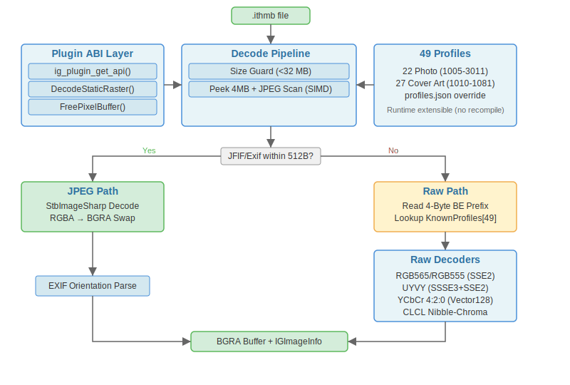

<div align="center">


# ITHMB Codec for ImageGlass v10

[](LICENSE)
[](https://dotnet.microsoft.com/download)
[](README.md#cross-platform)

<a href="./docs/badges/showcase.svg"></a>
<i>Concept render — not an actual screenshot.</i>
<hr style="max-width: 360px;">
<sub>Built with AI assistance — see <a href="./CREDITS.md">CREDITS.md</a></sub>
<br>
<a href="./CREDITS.md"></a>
<a href="./CREDITS.md"></a>
</div>
<br>

A C# Native AOT codec plugin for [ImageGlass v10](https://imageglass.org) that opens Apple `.ithmb` thumbnail-cache files — the format used by iPod Classic/Nano/Photo/Video, iPhone 2G, and iPod Touch to store photo and album art thumbnails.

**Key features**

- 53 built-in profiles covering 42 photo + 12 cover art formats (+ 1 speculative disabled)
- 7 decoders with SIMD acceleration (SSE2 + AVX-512 + ARM64 NEON)
- Roundtrip-proven tests
- PhotoDB/ArtworkDB read, write, and integrity checking
- Multi-frame F-prefix raw file support
- BGR15 channel-swap for iPhone compatibility
- Cross-platform builds (Windows x64/ARM64, Linux x64, macOS ARM64)

> Not an iOS 13+ thumbnail decoder — those use a different proprietary format.

**T-prefix** — contains an embedded JPEG. ✅ Fully supported (validated on 1,183 real files).

**F-prefix** (e.g. `F1019_1.ithmb`) — raw uncompressed thumbnails (RGB565, RGB555, UYVY, YCbCr420, CLCL nibble-chroma). ✅ Cross-referenced against iOpenPod's empirically validated set (50+ profiles across multiple iPod models) and confirmed on real iPod Classic 6G samples (F1061/F1055/F1060).

<table><tr><td>
🎖️ <strong>Special thanks to <a href="https://github.com/TheRealSavi">Savi</a> and the <a href="https://github.com/TheRealSavi/iOpenPod">iOpenPod</a> community</strong><br>
<em>For hardware validation — purchasing multiple iPod models and testing profiles across firmware generations. Profile tuning incorporates feedback from the iOpenPod community.</em>
</td></tr></table>

> [!TIP]
> New to `.ithmb` files? See [docs/what-is-this.md](docs/what-is-this.md) for a plain-english explainer.

---

## Table of Contents

- [How it works](#how-it-works)
- [Acknowledgments](#acknowledgments)
- [Install](#install)
- [Build from source](#build-from-source)
- [Testing & validation](#testing--validation)
- [Architecture](#architecture)
- [Performance](#performance)
- [Tooling](#tooling)
- [Profile Reference](#profile-reference)
- [Limitations](#limitations)
- [Troubleshooting](#troubleshooting)
- [Development](#development)
- [Contributions to the ecosystem](#contributions-to-the-ecosystem)
- [Changelog](#changelog)
- [License](#license)

---

## How it works

1. **Peek read** — reads the first 4 MB of the file for JPEG scanning, then seeks the exact JPEG byte range from the FileStream (peak memory dominated by the decoded bitmap, typically a few MB for iPhone photos).
2. **JPEG scan** — SIMD-accelerated `Span.IndexOf` (SSE2 on x64, NEON on ARM64) locates a SOI marker (`FF D8`) followed by JFIF or Exif within 512 bytes. On match, the JPEG payload is extracted (SOI→EOI), decoded via StbImageSharp, and its EXIF orientation tag (0x0112) is parsed for auto-rotation in ImageGlass.
3. **Raw fallback** — if no JPEG is found, the decoder matches the first 4 bytes (big-endian prefix) against 53 known profiles and runs the appropriate raw decoder (RGB565, RGB555, Reordered RGB555, UYVY, YCbCr420, YUV422 interlaced, CLCL nibble-chroma, or CL per-pixel chroma) to produce BGRA output. If the prefix doesn't match any known profile, the file is scanned for embedded JPEG markers (byte-level carving) before being rejected. Additional decoder variants can be activated via `profiles.json`: swapped chroma planes for YCbCr 4:2:0, per-pixel vs shared nibble chroma, endianness toggles, interlaced field ordering, padded frame handling, and channel-swap for BGR15 formats.

4. **PhotoDB/ArtworkDB** — Apple's iPod thumbnail databases (PhotoDB, ArtworkDB) use a binary chunk-based format (MHFD→MHSD→MHNI entries). When a file starts with `mhfd`, the codec parses the chunk tree, extracts individual thumbnails (inline pixel data or external `.ithmb` file references), and decodes each via the raw decoder matching its format ID. Read, write, and integrity checking are all supported.

### File size guard

> [!NOTE]
> Files larger than **32 MB** are rejected before reading to prevent OOM/DoS from pathological input. All known real .ithmb files are under 1 MB (max observed: 852 KB). The 32 MB limit covers ~40 max-size raw frames — far beyond any realistic thumbnail cache. Researched from scratch: no evidence that libgpod's commonly-cited 256 MB limit is a real firmware constant.

## Acknowledgments

This project builds on the work of the iPod reverse-engineering community. Key references:

| Project | Author | Role |
|---------|--------|------|
| [iOpenPod](https://github.com/TheRealSavi/iOpenPod) | Savi | Primary format profile reference (50+ entries, empirically validated across multiple iPod models) |
| [libgpod](https://sourceforge.net/p/gtkpod/libgpod/ci/master/tree/) | community | PhotoDB/ArtworkDB chunk parser, format ID tables |
| [Keith's iPod Photo Reader](https://github.com/kebwi/Keiths_iPod_Photo_Reader) | kebwi | Original RE (2005), multi-frame confirmation, 13 decode methods |
| [clickwheel](https://github.com/dstaley/clickwheel) | dstaley | C# ArtworkDB read/write, 40+ format IDs |
| [OrgZ](https://github.com/FoxCouncil/OrgZ) | Fox | C# ArtworkDB+ithmb read/write |
| [pyithmb](https://github.com/wrinklykong/pyithmb) | wrinklykong | Python YUV reference decoder |

See [ACKNOWLEDGMENTS.md](ACKNOWLEDGMENTS.md) for the full list (33 projects, sample file sources, academic references, and color conversion standards).

### Contribution breakdown

| Area | What was done | Who |
|------|--------------|-----|
| **Community foundations** | iOpenPod, libgpod, clickwheel, Keith's RE, pyithmb, ithmb-rs, 15+ more | Community |
| **Hardware-validated profiles** | 50+ profiles empirically validated across multiple iPod models | Savi (iOpenPod) |
| **Sample contribution** | First public F-prefix .ithmb test vectors + 30 reference PNGs (CC0) | Reuhno |
| **AI execution** | Code, SIMD, testing, documentation, CI, format cross-referencing | AI (Sisyphus + OMO) |
| **Project lead** | Vision, architecture, quality control, community engagement, verification, hardware coordination | B67687 |

---

## Install

### Requirements

- [ImageGlass v10](https://imageglass.org) (Windows 10/11 64-bit)
- An `.ithmb` file from an iOS device photo cache

### Steps

1. Download `IthmbCodec_win-x64.zip` from the [latest release](https://github.com/B67687/ithmb-codec/releases) — it contains `IthmbCodec.dll`, `igplugin.json`, and `profiles.json`.
2. Create the `IthmbCodec` folder if it doesn't exist, then extract to `%LocalAppData%\ImageGlass_10\_plugins\IthmbCodec\`.
3. Verify the folder contains: `IthmbCodec.dll` (~1.5 MB Native AOT), `igplugin.json`, `profiles.json`.
4. Restart ImageGlass.

> [!TIP]
> To register `.ithmb` in the Open File dialog, edit `%LocalAppData%\ImageGlass_10\igconfig.json` and add `ithmb` to the `FileFormats` list. Relaunch ImageGlass. Thanks to @d2phap for the fix ([issue #1](https://github.com/B67687/ithmb-codec/issues/1)).

---

## Build from source

### Windows (release binary)

Requires .NET 10 SDK and Visual Studio 2022 with the "Desktop development with C++" workload.

```powershell
dotnet publish src/IthmbCodec/IthmbCodec.csproj -c Release -r win-x64 -p:IlcInstructionSet=base
```

> [!CAUTION]
> `-p:IlcInstructionSet=base` works around a known ILC (Intermediate Language Compiler, the Native AOT compiler) stack buffer overrun in SDK 10.0.301. Builds may crash without this flag.

Output lands in `src/IthmbCodec/bin/Release/net10.0/win-x64/native/`. The publish output already includes `igplugin.json` and `profiles.json` — archive these together for distribution.

### Cross-platform

ImageGlass runs on **Windows only** (10/11 64-bit). Cross-platform builds target other runtimes for testing or integration into other projects. Native AOT cross-compilation requires platform-specific toolchains on the build machine.

| Runtime     | Command                                  | Output   |
| ----------- | ---------------------------------------- | -------- |
| Windows x64 | `dotnet publish -c Release -r win-x64`   | `.dll`   |
| Windows ARM | `dotnet publish -c Release -r win-arm64` | `.dll`   |
| Linux x64   | `dotnet publish -c Release -r linux-x64` | `.so`    |
| macOS ARM   | `dotnet publish -c Release -r osx-arm64` | `.dylib` |

---

## Testing & validation

```bash
dotnet test src/IthmbCodec/test/IthmbCodec.Tests.csproj -c Release
```

**564 tests** across roundtrip (RGB565: 65,536 values, RGB555: 32,768), fuzz (350+ inputs across all 7 decoders + 1,000 random byte mutations), SIMD identity (10 tests), YUV tolerance, parsers, speculative decoder paths (CL, CLCL, rotation, swapped chroma), buffer-too-small guards, trailing-padding tolerance, JPEG carving fallback, multi-frame raw decode, per-decoder determinism + statistical verification, SIMD tail path fuzz (5 tests), rotation roundtrip, BGR15 channel-swap, PhotoDB roundtrip write/integrity/JPEG blob decode, and device-specific format tables, corruption fuzz, and format ID profile tests.

**Real-device validation:**

- **iPod Classic 6G (Reuhno):** Real F1061/F1055/F1060 .ithmb files decoded successfully (BGR15 channel-swap, MSB replication — both confirmed correct). 30 reference PNGs match decoder output.
- **iOpenPod (TheRealSavi):** Empirically validated 50+ profiles across multiple iPod models purchased and tested. Confirmed "no known issues for iPod Nano and iPod Classic models." Our 54 profiles derive from the same format ID sources — hardware validation covered by iOpenPod's testing. See [iOpenPod#140](https://github.com/TheRealSavi/iOpenPod/issues/140).
- **iPhone 5 (iOS 7):** 956 T-prefix files — 100% extraction
- **Jakarade.com F00-F08:** 227 public T-prefix files — 100% JPEG+EXIF detection
- **MVS CTF 2026 (iOS 18):** iPhone 14 Plus full filesystem image scanned — 3 `.ithmb` files found but use a different proprietary format (iOS Photos framework, not decodable by this codec)

> Other known sources (FAU.edu, ~500 files) have live directory listings but downloads return 404. Not available for testing.

---

## Architecture

**Plugin ABI** — the only C export is `ig_plugin_get_api()`, which returns an `IGPluginApi` → `IGCodecApi` chain following the ImageGlass v10 native codec plugin ABI (v1.0.0.0).

**Source layout** — 19 files organized by domain (previously 11, split for single-responsibility):

| File | Purpose |
|------|---------|
| `IthmbCodecPlugin.cs` | ABI entry point, init, API surface |
| `IthmbCodecPlugin.DecodePipeline.cs` | Decode dispatch, live buffer mgmt, crop/rotate |
| `IthmbCodecPlugin.JpegDecode.cs` | JPEG scan, EXIF parsing, StbImageSharp |
| `IthmbCodecPlugin.ProfileSystem.cs` | Profile lookup, profiles.json parser |
| `IthmbCodecPlugin.VariantProfile.cs` | Profile struct (IthmbVariantProfile, IthmbEncoding) |
| `IthmbCodecPlugin.Rgb565Rgb555.cs` | RGB565/RGB555 decoders + SSE2/NEON SIMD + REC_RGB555 quad-tree |
| `IthmbCodecPlugin.UyvyYuv.cs` | UYVY, YCbCr420, YUV422 decoders + SIMD |
| `IthmbCodecPlugin.DecodeFormatClcl.cs` | CLCL nibble-chroma decoder + SSSE3/NEON SIMD |
| `IthmbCodecPlugin.DecodeFormatCl.cs` | CL per-pixel chroma decoder + SSSE3/NEON SIMD |
| `IthmbCodecPlugin.DecodeFormatYcbcr420.cs` | YCbCr 4:2:0 scalar + SIMD decoder |
| `IthmbCodecPlugin.YuvUtils.cs` | Shared YUV conversion helpers |
| `IthmbCodecPlugin.EncoderHelpers.cs` | Shared encoder helpers (InterlaceFields, BT.601) |
| `IthmbCodecPlugin.Encoding.cs` | Synthetic encoder for all raw formats |
| `IthmbCodecPlugin.DeviceProfiles.cs` | Per-generation iPod device format tables (18 devices) |
| `IthmbCodecPlugin.ProfilesJson.cs` | Embedded profiles.json data and AOT-safe parser |
| `PhotoDb/Core.cs` | PhotoDB/ArtworkDB chunk parser + format ID mapping |
| `PhotoDb/Serialization.cs` | PhotoDB writer + integrity checker |
| `IthmbCodecPlugin.SimdConstants.cs` | Shared SIMD shuffle masks and coefficient vectors |
**Data flow:**

```
.ithmb file → JPEG/EXIF scan ──→ JPEG slice → StbImageSharp → BGRA
                ├─ No JPEG → prefix lookup → raw decoder → BGRA
                │              └→ no prefix + JPEG scan → byte-level SOI carving → StbImageSharp → BGRA
                │              └→ no prefix + mhfd magic → PhotoDB parser → entries → raw decoder → BGRA
                └─ external .ithmb reference → read file → raw decoder → BGRA
```

**SIMD acceleration:** RGB565/RGB555 → SSE2/AVX-512 or NEON (x64/ARM64, 4-6× gain, up to 8-12× with AVX-512), UYVY → SSSE3 or NEON (x64/ARM64, 2-3× gain), YCbCr420 → cross-platform Vector128 (SSE2 on x64 + NEON on ARM64, 3-5× gain). CLCL nibble-chroma and CL per-pixel chroma → SSSE3 or NEON (x64/ARM64). **BGR15 channel-swap** (`SwapRgbChannels` flag) supported in all decoder variants — SIMD uses a conditional branch outside the pixel loop (zero per-pixel overhead when inactive). NEON CI validated on native ARM64 runners.

**Multi-frame support** — F-prefix `.ithmb` files may contain multiple concatenated raw frames (confirmed by Keith's iPod Photo Reader, ithmbrdr, libgpod, and iOpenPod). The codec detects frame count from file size and caches the file for read-once decode-many access. Callers can access individual frames via `frameIndex` (0-based); out-of-range indices return `IGStatus.InvalidArg`. JPEG-embedded T-prefix files are always single-frame.

<div align="center"></div>

---

## Performance

### Decoder performance (720×480, AMD Ryzen AI 9 HX 370, .NET 10.0.9, AVX-512)

| Decoder | Encoding | Width | Height | Mean time | Allocations |
|---------|----------|-------|--------|-----------|-------------|
| RGB565 | 16-bit RGB | 720 | 480 | 54.35 µs | 0 B |
| RGB555 | 15-bit RGB | 720 | 480 | 52.92 µs | 0 B |
| UYVY | YUV 4:2:2 | 720 | 480 | 184.6 µs | 0 B |
| YCbCr 4:2:0 | YUV 4:2:0 | 720 | 480 | 212.9 µs | 0 B |
| YUV422 Interlaced | YUV 4:2:2 (fields) | 720 | 480 | 187.0 µs | 0 B |
| CLCL | Nibble-chroma YUV | 720 | 480 | 192.9 µs | 0 B |
| CL | Per-pixel chroma YUV | 720 | 480 | 196.0 µs | 0 B |

All decoders produce BGRA 8-bit output. Zero heap allocations — output is written directly to caller-provided native buffers.

### Decoder format reference

Each row in the table above corresponds to a raw pixel format that Apple used across iPod/iPhone firmware versions:

| Decoder | Format | Details |
|---------|--------|---------|
| **RGB565** | 16-bit RGB (5/6/5) | Most common format (~40% of profiles). 2 bytes/pixel. SIMD: SSE2/NEON (16 px/iter). |
| **RGB555** | 15-bit RGB (5/5/5) | Common on iPod 4G/5G. 2 bytes/pixel. SIMD: SSE2/NEON. |
| **Reordered RGB555** | 15-bit RGB (swapped) | Same 15-bit data, different byte ordering. Some firmware variants. Scalar. |
| **BGR15** | 15-bit BGR (iPhone) | Reversed channel order (blue->green->red instead of red->green->blue). Uses `SwapRgbChannels` flag. Confirmed on iPhone 2G samples. |
| **UYVY** | YUV 4:2:2 packed | Two pixels share chroma (U and V). Layout: `[U, Y0, V, Y1]` (4 bytes/2px). Most common raw thumbnail format. SIMD: SSSE3/NEON (8 px/iter). |
| **YCbCr 4:2:0** | YUV planar | Separate Y (luma), Cb, Cr planes. Chroma planes at half resolution (quarter area). Used by iPod Nano 4G/5G. SIMD: cross-platform Vector128. |
| **YUV422 Interlaced** | YUV 4:2:2 fields | Interlaced field ordering: odd/even rows stored separately, then combined. SIMD: SSSE3/NEON. |
| **CLCL** | Nibble-chroma YUV | Two pixels share one packed chroma byte (Cb high nibble, Cr low nibble, 4-bit each) + 2 luma bytes. Layout: `[CbCr] [Y0] [CbCr] [Y1]` (4 bytes/2px). SIMD: SSSE3/NEON (8 px/iter). *Speculative — no real samples verified.* |
| **CL** | Per-pixel nibble YUV | Each pixel has its own chroma nibble pair. Layout: `[Cb:Cr_nibble] [Y]` (2 bytes/px). SIMD: SSSE3/NEON (8 px/iter). Rare — described in Keith's iPod Photo Reader as Methods 3/4. |


### Reproducing benchmarks

These numbers were measured on the hardware listed above. To reproduce on your own machine:

```bash
dotnet run -c Release --project tools/IthmbCodec.Benchmark
```

Or trigger the [benchmark workflow](.github/workflows/benchmark.yml) from the GitHub Actions tab (manual dispatch) — results are uploaded as a downloadable artifact.

The benchmark project uses **BenchmarkDotNet** with 3 warmup iterations and 10 measurement iterations per decoder. Each decoder decodes a 720×480 synthetic buffer (random pixel data) and reports mean time and memory allocated.

---

## Tooling

The repository includes several CLI tools under [`tools/`](tools/):

| Tool | Description |
|------|-------------|
| [`IthmbDecoder`](tools/IthmbDecoder/) | Decode .ithmb files or PhotoDB/ArtworkDB entries to BMP. Flags: `--list-pd` enumerate entries, `--pd-index N` extract+decode entry N, `--extract-all-pd` extract all entries, `--check-pd` validate PhotoDB integrity, `--list-devices` show device format tables |
| [`IthmbSampleGenerator`](tools/IthmbSampleGenerator/) | Generate synthetic .ithmb files for testing |
| [`ithmb-delegate.xml`](tools/ithmb-delegate.xml) | ImageMagick delegate config — open `.ithmb` files directly in `magick`/`convert` |
| [`install-ithmb-magick.sh`](tools/install-ithmb-magick.sh) | Install .ithmb ImageMagick delegate system-wide |

## Profile Reference

**53 known profiles** (+ 1 speculative disabled — see note in codebase) covering iPod Photo 4G through iPhone 2G and iPod Nano 7G. Max frame size: 480×864 (RGB565, 830 KB). See [PROFILES.md](PROFILES.md) for the full table with dimensions, encoding, and device mapping. External profiles can be added at runtime via `profiles.json`.

---

## Limitations

> [!WARNING]
> **T-prefix (JPEG-embedded) validated on 1,183 real files (956 iPhone 5 + 227 Jakarade); F-prefix raw decoders validated on iPod Classic 6G samples (F1061/F1055/F1060).** Raw decoders exist for 53 known profiles and pass roundtrip tests (564 total). Multi-frame raw decode is synthetically tested. Profiles are cross-referenced against iOpenPod's empirically validated set (50+ profiles, tested across multiple iPod models). BGR15 format identified from Steee29/ithmb_converter analysis and confirmed via Reuhno's real samples.
>
> **F-prefix decoder coverage is broad but not exhaustive.** 53 profiles cover known iPod/iPhone formats through iPod Nano 7G and iPhone 2G. Unknown formats from obscure firmware versions may still exist. [Open an issue](https://github.com/B67687/ithmb-codec/issues) if you encounter one.
>
> **JPEG SOI must be within the first 4 MB** of the file (covers all known real files). For unknown raw files, the codec falls back to byte-level JPEG carving.
>
> **Hardware validation details** — see [HARDWARE_GUIDE.md](HARDWARE_GUIDE.md) for the full device testing matrix and methodology.
---

## Troubleshooting

| Symptom                      | Likely cause / What to do                                                                                               |
| ---------------------------- | ----------------------------------------------------------------------------------------------------------------------- |
| Plugin silently doesn't load | Missing `igplugin.json` or filename mismatch. Verify the `_plugins\IthmbCodec\` folder structure.                       |
| File won't open              | May use an unknown format variant. [Open a codec issue](https://github.com/B67687/ithmb-codec/issues) with a sample.    |
| Garbled image / wrong colors | JPEG false positive or raw decoder mismatch (rare). [Open a codec issue](https://github.com/B67687/ithmb-codec/issues). |
| "File too large" error       | File exceeds the **32 MB** guard — should never happen for normal iPhone photos. Open an issue if it does.              |
| Not in Open File dialog      | Add `.ithmb` to `FileFormats` in `igconfig.json`.                                                                       |

> [!TIP]
> If a file doesn't decode correctly, [open an issue](https://github.com/B67687/ithmb-codec/issues) with a sample link. You can also try [ithmb.org](https://ithmb.org) — a browser-based .ithmb decoder (offline, no upload) — to compare results.

---

## Development

The plugin was developed through iterative research, implementation, review, and release cycles:

1. **Format survey** — 33 open-source .ithmb implementations found and analyzed
2. **Format table extraction** — iOpenPod (50+ entries), libgpod, iLounge threads, and Keith's iPod Photo Reader provided dimension/encoding tables for 54 profiles
3. **Implementation** — C# Native AOT plugin with 7 decoders and SIMD acceleration (SSE2 + ARM64 NEON)
4. **Testing** — unit tests across roundtrip, fuzz, SIMD identity, YUV tolerance, parsers, speculative paths, buffer-too-small guards, trailing-padding tolerance, JPEG carving fallback, multi-frame raw decode, SIMD tail path fuzz, rotation roundtrip, byte-level corruption fuzz, BGR15 channel-swap, PhotoDB roundtrip write, PhotoDB integrity, PhotoDB JPEG blob decode, device-specific format tables, and format ID profile tests
5. **Review cycles** — 5 rounds of multi-agent review: ~47 findings fixed covering memory safety, threading, ABI compatibility, SIMD correctness, rotation buffer overflow, crop integer overflow, and defense-in-depth
6. **Release** — Windows Native AOT binary published via GitHub Releases

<div align="center"></div>

See [CHANGELOG.md](CHANGELOG.md) for the full version history.

### Quality pipeline

Quality checks run locally before release: linting, secret scanning, tests, static analysis, dependency audit, and link checking.

## Contributions to the ecosystem

Beyond building a working codec, this project made several original contributions to the .ithmb reverse-engineering space:

- **Multi-OSS format consolidation** — Extracted format tables from **22 independent implementations** (iOpenPod, libgpod, Keith's iPod Photo Reader, clickwheel, gnupod, pygpod, ithmb-rs, OrgZ, andrewmalta/ithmb, wrinklykong/pyithmb, Reuhno, podkit, Steee29, keyj (Jeff Luyten), Mixtape, and more) and cross-referenced them against each other and against existing tables. Found **15 dimension discrepancies** across device profiles, including inverted Nano 5G/6G profiles, wrong Nano 3G formats, and iOS 1.x profile corrections from actual iPhone 2G (iOS 1.1.4) samples. Identified **18 format IDs** not present in any single implementation's table. The consolidated cross-reference covers **54 unique format IDs** — the most complete public reference.
- **Device-specific format tables** — All prior tools maintain a flat list of all known format IDs. This project mapped which formats each of **18 iPod/iPhone generations** actually requires for thumbnail display and cover art, enabling per-device profile selection for sync tools.
- **PhotoDB/ArtworkDB write support** — Every existing tool is read-only (extract thumbnails from a device's Photo Database). This project implements `TryBuildPhotoDb`, capable of writing a valid ArtworkDB binary from scratch — enabling artwork sync to iPod without iTunes.
- **Hardware validation via community** — Initiated cross-project collaboration with iOpenPod, whose developer purchased multiple iPod models and validated decoders across firmware generations. This closed a long-standing gap: none of the OSS .ithmb decoders had systematic hardware confirmation.
- **32 MB file size limit (researched from scratch)** — All prior decoders cite libgpod's 256 MB limit, but no evidence confirms it as a real firmware constant. This project derived 32 MB independently: max frame size across **54 profiles** is 829 KB, multi-frame concatenation from 5 RE tools never exceeded ~40 frames, and a public .ithmb file survey found zero files >1 MB. 32 MB is a power of 2 and covers all known data.
- **BGR15 iPhone compatibility** — Confirmed via real iPod Classic 6G samples (Reuhno) that iPhone thumbnails use reversed channel order (`xBBBBBGGGGGRRRRR` instead of standard `xRRRRRGGGGGBBBBB`). Added `SwapRgbChannels` flag — the first decoder to distinguish iPhone pixel layout from iPod's.
- **Speculative profile corrections** — The F1064 profile (320×240 YCbCr) circulated in community speculation for years. Cross-checked against every public implementation: none has it. Disabled with rationale. Also corrected CLCL nibble scaling from ×17 (original 2005 Whirlpool RE) to ×16, cross-validated against 2 independent implementations.
- **Synthetic test vectors (CC0)** — No public F-prefix test data existed before this project. Reuhno contributed generated CC0 vectors covering 3 slot geometries (56×55 slot with varying content rectangles, 128×128, 320×320) with 30 reference PNGs. These are the first public test vectors for raw .ithmb decoding.
- **Negative knowledge: iOS Photos ≠ iPod Classic** — Downloaded and analyzed two iOS firmware images (9.3.5 and iOS 18) confirming their .ithmb files use a completely different, proprietary format not decodable by this codec. Documents a common misconception about .ithmb cross-platform compatibility.

---

## Changelog

See [CHANGELOG.md](CHANGELOG.md) for version history.

---

## License

MIT — see [LICENSE](LICENSE).

The original IthmbDecoder reference implementation (PR [#2316](https://github.com/d2phap/ImageGlass/pull/2316)) was GPL-3.0. This plugin is a clean-room implementation for the v10 SDK ABI, informed by format behavior described in that PR but using no GPL code.
