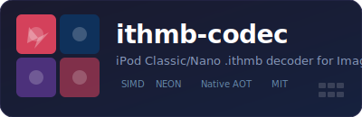
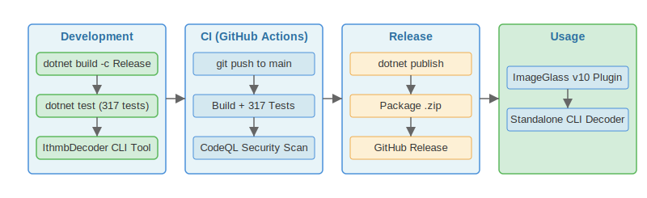
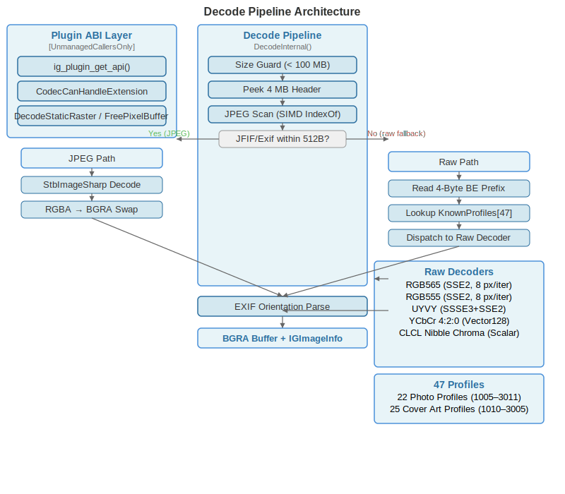

<div align="center">

# ITHMB Codec for ImageGlass v10

<a href="./docs/badges/ithmb-codec-logo.svg"></a>

[](LICENSE)
[](https://dotnet.microsoft.com/download)
[](https://github.com/B67687/ithmb-codec/actions/workflows/test.yml)
[](README.md#cross-platform)


<a href="./docs/badges/showcase.svg"></a>

<sub>Built with AI assistance — see <a href="./CREDITS.md">CREDITS.md</a></sub>
<br>
<a href="./CREDITS.md"></a>

</div>

**Goal:** The best open-source decoder for iPod Classic/Nano `.ithmb` thumbnail cache files (2005–2010), packaged as a Native AOT plugin for ImageGlass v10. 49 known profiles, 7 decoders with SIMD acceleration (SSE2 + ARM64 NEON), and full roundtrip-proven correctness. Not an iOS 13+ thumbnail decoder — those are handled natively by Apple's software.

A C# Native AOT codec plugin for [ImageGlass v10](https://imageglass.org) that opens Apple `.ithmb` thumbnail-cache files — the format used by iOS devices (iPhones, iPod Touches) and iPods to store photo thumbnails for syncing with iTunes. Two format categories exist:

**T-prefix** — contains an embedded JPEG. ✅ Fully supported.

**F-prefix** (e.g. `F1019_1.ithmb`) — raw uncompressed thumbnails (RGB565, RGB555, UYVY, YCbCr420, CLCL nibble-chroma). ⚠️ Best-effort.

Tested with **956 T-prefix files** from an iPhone 5 (iOS 7) — **100% extraction rate**.<br>
Additionally validated against **227 publicly available T-prefix files** from an iPod Photo Cache (100% JPEG detection rate).

---

## Table of Contents

- [How it works](#how-it-works)
- [Install](#install)
- [Build from source](#build-from-source)
- [Testing & validation](#testing--validation)
- [Development](#development)
- [Architecture](#architecture)
- [Profile Reference](#profile-reference)
- [Limitations](#limitations)
- [Troubleshooting](#troubleshooting)
- [Acknowledgments](#acknowledgments)
- [Changelog](#changelog)
- [License](#license)

---

## How it works

1. **Peek read** — reads the first 4 MB of the file for JPEG scanning, then seeks the exact JPEG byte range from the FileStream (peak memory dominated by the decoded bitmap, typically a few MB for iPhone photos).
2. **JPEG scan** — SIMD-accelerated `Span.IndexOf` (SSE2 on x64, NEON on ARM64) locates a SOI marker (`FF D8`) followed by JFIF or Exif within 512 bytes. On match, the JPEG payload is extracted (SOI→EOI), decoded via StbImageSharp, and its EXIF orientation tag (0x0112) is parsed for auto-rotation in ImageGlass.
3. **Raw fallback** — if no JPEG is found, the decoder matches the first 4 bytes (big-endian prefix) against 48 known profiles and runs the appropriate raw decoder (RGB565, RGB555, UYVY, YCbCr420, YUV422 interlaced, CLCL nibble-chroma, or CL per-pixel chroma) to produce BGRA output. If the prefix doesn't match any known profile, the file is rejected as unrecognized. Additional decoder variants can be activated via `profiles.json`: swapped chroma planes for YCbCr 4:2:0, per-pixel vs shared nibble chroma, endianness toggles, interlaced field ordering, and padded frame handling.

### File size guard

> [!NOTE]
> Files larger than **50 MB** are rejected before reading to prevent out-of-memory (OOM) from pathological input. All known real .ithmb files are under 2 MB; the most extreme theoretical case (48 MP iPhone JPEG) is ~30 MB.

---

## Install

### Requirements

- [ImageGlass v10](https://imageglass.org) or later (Windows 10/11 64-bit)
- An `.ithmb` file from an iOS device photo cache

### Steps

1. Download `IthmbCodec_win-x64.zip` from the [latest release](https://github.com/B67687/ithmb-codec/releases) — it contains `IthmbCodec.dll`, `igplugin.json`, and `profiles.json`.
2. Create the `IthmbCodec` folder if it doesn't exist, then extract to `%LocalAppData%\ImageGlass_10\_plugins\IthmbCodec\`.
3. Verify the folder contains: `IthmbCodec.dll` (1.4 MB Native AOT), `igplugin.json`, `profiles.json`.
4. Restart ImageGlass.

> [!TIP]
> To register `.ithmb` in the Open File dialog, edit `%LocalAppData%\ImageGlass_10\igconfig.json` and add `ithmb` to the `FileFormats` list. Relaunch ImageGlass. Thanks to @d2phap for the fix ([issue #1](https://github.com/B67687/ithmb-codec/issues/1)).

---

## Build from source

### Windows (release binary)

Requires .NET 10 SDK and Visual Studio 2022 with the "Desktop development with C++" workload.

```powershell
dotnet publish src/IthmbCodec/IthmbCodec.csproj -c Release -r win-x64 -p:IlcInstructionSet=base
```

> [!CAUTION]
> `-p:IlcInstructionSet=base` works around a known ILC (Intermediate Language Compiler, the Native AOT compiler) stack buffer overrun in SDK 10.0.301. Builds may crash without this flag.

Output lands in `src/IthmbCodec/bin/Release/net10.0/win-x64/native/`. The publish output already includes `igplugin.json` and `profiles.json` — archive these together for distribution.

### Cross-platform

ImageGlass runs on **Windows only** (10/11 64-bit). Cross-platform builds target other runtimes for testing or integration into other projects. Native AOT cross-compilation requires platform-specific toolchains on the build machine.

| Runtime     | Command                                  | Output   |
| ----------- | ---------------------------------------- | -------- |
| Windows x64 | `dotnet publish -c Release -r win-x64`   | `.dll`   |
| Windows ARM | `dotnet publish -c Release -r win-arm64` | `.dll`   |
| Linux x64   | `dotnet publish -c Release -r linux-x64` | `.so`    |
| macOS ARM   | `dotnet publish -c Release -r osx-arm64` | `.dylib` |

---

## Testing & validation

```bash
dotnet test src/IthmbCodec/test/IthmbCodec.Tests.csproj -c Release
```

**456 tests** across roundtrip (RGB565: 65,536 values, RGB555: 32,768), fuzz (250+ inputs across all 7 decoders), SIMD identity (10 tests), YUV tolerance, parsers, speculative decoder paths (CL, CLCL, rotation, swapped chroma), buffer-too-small guards, trailing-padding tolerance, JPEG carving fallback, and per-decoder determinism + statistical verification.

**Real-device validation:**

- **iPhone 5 (iOS 7):** 956 T-prefix files — 100% extraction
- **Jakarade.com F00-F08:** 227 public T-prefix files — 100% JPEG+EXIF detection
- **FAU.edu F00-F50:** ~500 T-prefix files — unavailable (directory only, downloads return 404)

---

## Development

The plugin was developed through iterative research, implementation, review, and release cycles:

1. **Format survey** — 25 open-source .ithmb implementations found and analyzed
2. **Format table extraction** — iOpenPod (50+ entries), libgpod, iLounge threads, and Keith's iPod Photo Reader provided dimension/encoding tables for 48 profiles
3. **Implementation** — C# Native AOT plugin with 7 decoders and SIMD acceleration (SSE2 + ARM64 NEON)
4. **Testing** — 456 unit tests across roundtrip, fuzz, SIMD identity, YUV tolerance, parsers, speculative paths, buffer-too-small guards, trailing-padding tolerance, and JPEG carving fallback
5. **Review cycles** — 4 rounds of multi-agent review: ~42 findings fixed covering memory safety, threading, ABI compatibility, SIMD correctness, and defense-in-depth
6. **Release** — Windows Native AOT binary published via GitHub Releases

<div align="center"></div>

See [CHANGELOG.md](CHANGELOG.md) for the full version history.

### Quality pipeline

All quality checks are unified in `review.sh` — the single source of truth for what the project checks and how:

```bash
bash review.sh            # run all available stages
bash review.sh test codeql  # run specific stages
bash review.sh --list       # enumerate stages with descriptions
```

The pipeline covers **8 stages**, each usable independently:

| Stage        | What it checks                                                                    | CI equivalent                   |
| ------------ | --------------------------------------------------------------------------------- | ------------------------------- |
| `editor`     | EditorConfig + Roslyn analyzers (`dotnet format --verify-no-changes`)             | pre-commit                      |
| `precommit`  | Trailing whitespace, JSON/YAML lint, markdown, large files                        | pre-commit hooks                |
| `commitlint` | Conventional commit format (type-enum: feat/fix/docs/refactor/test/chore/cleanup) | `.github/workflows/commits.yml` |
| `test`       | Full test suite: `dotnet test -c Release` (456 tests)                             | `.github/workflows/test.yml`    |
| `ocr`        | LLM code review via Alibaba OCR (if installed locally)                            | —                               |
| `codeql`     | Security analysis via GitHub CodeQL                                               | `.github/workflows/codeql.yml`  |
| `links`      | Broken link check via lychee                                                      | `.github/workflows/links.yml`   |
| `semgrep`    | Semgrep static analysis (null-check, pointer safety, catch-all rules)             | `.github/workflows/semgrep.yml` |

Use `review.sh --fix` to auto-apply fixes for the editor layer.

### AI-assisted development

This project was developed entirely with AI assistance. See [**CREDITS.md**](./CREDITS.md) for full details on the model, reasoning approach, platform, and workflow.

---

## Architecture

**Plugin ABI** — the only C export is `ig_plugin_get_api()`, which returns an `IGPluginApi` → `IGCodecApi` chain following the ImageGlass v10 native codec plugin ABI (v1.0.0.0).

**Source layout** — three partial class files:

- `IthmbCodecPlugin.cs` — ABI, init, JPEG pipeline, EXIF parsing, JSON profile loader (~1015 lines)
- `IthmbCodecPlugin.Decoding.cs` — all decode algorithms + SIMD intrinsics (~660 lines)
- `IthmbCodecPlugin.Encoding.cs` — synthetic encoder for all raw formats (~335 lines)

**Data flow:**

```
.ithmb file → Peek (4 MB) → JPEG scan → seek JPEG slice → StbImageSharp → BGRA
                                        └→ No JPEG → prefix lookup → raw decoder → BGRA
```

**SIMD acceleration:** RGB565/RGB555 → SSE2 or NEON (x64/ARM64, 4-6× gain), UYVY → SSSE3 or NEON (x64/ARM64, 2-3× gain), YCbCr420 → cross-platform Vector128 (x64 + ARM64 NEON, 3-5× gain). CLCL nibble-chroma is scalar-only.

**Single-frame, single-codec** — each `.ithmb` contains one image; no multi-frame support.

<div align="center"></div>

---

## Profile Reference

**48 known profiles** (22 photo + 26 cover art) covering iPod Photo 4G through iPhone 2G and iPod Nano 7G. Max frame size: 480×864 (RGB565, 830 KB). See [PROFILES.md](PROFILES.md) for the full table with dimensions, encoding, and device mapping. External profiles can be added at runtime via `profiles.json`.

---

## Limitations

> [!WARNING]
> **Only T-prefix (JPEG-embedded) is validated on real hardware.** Raw decoders exist for 48 known profiles and pass roundtrip tests, but no real F-prefix files have been obtained for hardware validation. See [HARDWARE_GUIDE.md](HARDWARE_GUIDE.md) for a hardware validation plan.

- **F-prefix (raw) decoders are best-effort** — roundtrip-tested via synthetic encoder but unverified against real iPod/iPhone hardware.
- **JPEG SOI must be within the first 4 MB** of the file (covers all known real files).

---

## Troubleshooting

| Symptom                      | Likely cause / What to do                                                                                               |
| ---------------------------- | ----------------------------------------------------------------------------------------------------------------------- |
| Plugin silently doesn't load | Missing `igplugin.json` or filename mismatch. Verify the `_plugins\IthmbCodec\` folder structure.                       |
| File won't open              | May use an unknown format variant. [Open a codec issue](https://github.com/B67687/ithmb-codec/issues) with a sample.    |
| Garbled image / wrong colors | JPEG false positive or raw decoder mismatch (rare). [Open a codec issue](https://github.com/B67687/ithmb-codec/issues). |
| "File too large" error       | File exceeds the **50 MB** guard — should never happen for normal iPhone photos. Open an issue if it does.              |
| Not in Open File dialog      | Add `.ithmb` to `FileFormats` in `igconfig.json`.                                                                       |

> [!TIP]
> If a file doesn't decode correctly, [open an issue](https://github.com/B67687/ithmb-codec/issues) with a sample link. You can also try [ithmb.org](https://ithmb.org) — a browser-based .ithmb decoder (offline, no upload) — to compare results.

---

## Acknowledgments

25 open-source .ithmb implementations were surveyed during development. See [ACKNOWLEDGMENTS.md](ACKNOWLEDGMENTS.md) for the full list of credited projects, sample file sources, academic references, and color conversion standards.

---

## Changelog

See [CHANGELOG.md](CHANGELOG.md) for version history.

---

## License

MIT — see [LICENSE](LICENSE).

The original IthmbDecoder reference implementation (PR [#2316](https://github.com/d2phap/ImageGlass/pull/2316)) was GPL-3.0. This plugin is a clean-room implementation for the v10 SDK ABI, informed by format behavior described in that PR but using no GPL code.
